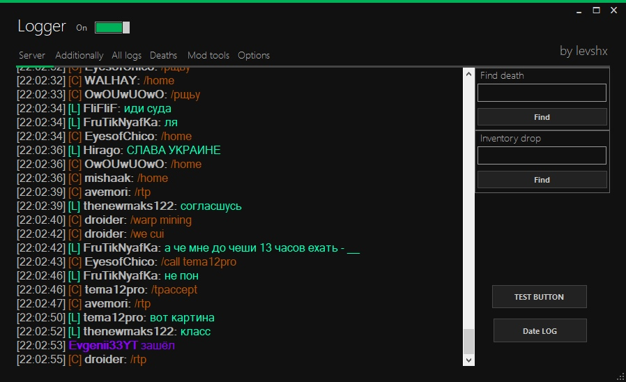

# logger-mc-server

<!-- # Short Description -->

Minecraft server LOGGER

<!-- # Badges -->

# Tags

`C#` `.NET` `Minecraft` `Server`

# Demo

### Message types:
* [G] Global chat
* [L] Local chat
* [C] Commands
* [M] Message [/mail /m /msg /r /w]
* [PvP] Kills
* [P] Death/Kicked/Join/Left/AFK/noAFK
* [S] Shutdown/Starting

### Triggers:
* custom triggers

# Installation

[Download](https://github.com/levshx/logger-mc-server/releases/tag/Ant) `Release-logger-mc.zip`

# Deployment

.NET Framework 4.7.2

NuGet:
* Newtonsoft.Json 13.0.1
* MetroModernUI 1.4.0.0

# Contributors

- [levshx](https://github.com/levshx)

<!-- CREATED_BY_LEADYOU_README_GENERATOR -->
